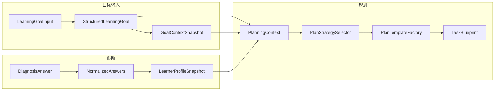
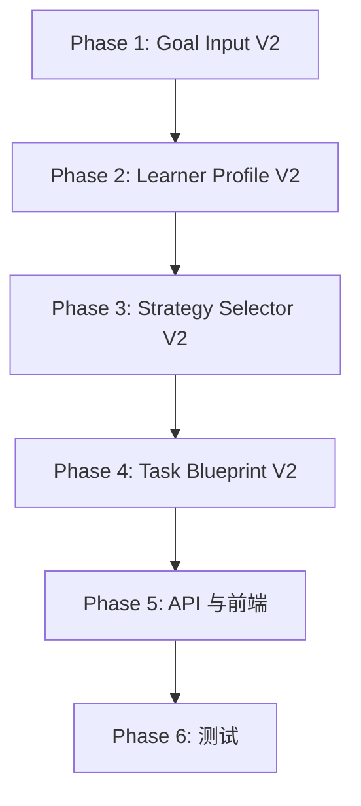

# Sprint 2.5 决策模型收口与执行脚手架硬化

---

## 一、仓库理解摘要

### 1.1 相关模块与文件

| 模块   | 核心文件                                                                                                                                                                                                                                                                                                                                        | 职责                                                     |
| ---- | ------------------------------------------------------------------------------------------------------------------------------------------------------------------------------------------------------------------------------------------------------------------------------------------------------------------------------------------- | ------------------------------------------------------ |
| 目标输入 | [LearningGoalInput.java](backend/src/main/java/navigator/domain/model/LearningGoalInput.java), [GoalRuleEngine.java](backend/src/main/java/navigator/application/goal/GoalRuleEngine.java), [GoalContextDeriver.java](backend/src/main/java/navigator/application/goal/GoalContextDeriver.java)                                             | Input → StructuredLearningGoal → GoalContextSnapshot   |
| 用户画像 | [LearnerProfileSnapshot.java](backend/src/main/java/navigator/domain/model/LearnerProfileSnapshot.java), [DiagnosisRuleEngine.java](backend/src/main/java/navigator/application/diagnosis/DiagnosisRuleEngine.java), [DiagnosisAnswerNormalizer.java](backend/src/main/java/navigator/application/diagnosis/DiagnosisAnswerNormalizer.java) | 诊断答案 → NormalizedAnswers → LearnerProfileSnapshot      |
| 策略选择 | [PlanStrategySelector.java](backend/src/main/java/navigator/application/planning/PlanStrategySelector.java), [PlanTemplateFactory.java](backend/src/main/java/navigator/application/planning/PlanTemplateFactory.java), [RecommendedStrategyCode.java](backend/src/main/java/navigator/domain/enums/RecommendedStrategyCode.java)           | ctx → 字符串策略 → RecommendedStrategyCode → stages + tasks |
| 任务执行 | [TaskBlueprint.java](backend/src/main/java/navigator/domain/model/TaskBlueprint.java), [PlanTemplateFactory.task()](backend/src/main/java/navigator/application/planning/PlanTemplateFactory.java), [ExecutionApplicationService.java](backend/src/main/java/navigator/application/ExecutionApplicationService.java)                        | 策略 → TaskBlueprint[] → CurrentTaskData → 完成证据          |

### 1.2 现有对象流转

### 1.3 现有规则链路

- **GoalRuleEngine**：rawGoalText + hint → goalType, topicScopeType, urgencyLevel, expectedDepth（正则 + 启发式）
- **GoalContextDeriver**：goal → planningMode, entryGranularity, riskTags, strategyHints
- **DiagnosisRuleEngine**：foundationCode + gapCodes + goal + goalContext → foundationLevel, blockerTags, riskTags, suggestedEntryStrategy 等
- **PlanStrategySelector**：goal.topicScopeType, goal.goalType, goal.urgencyLevel, profile.foundationLevel, profile.riskTags, profile.blockerTags → 6 种字符串策略之一

### 1.4 最影响 Sprint 2.5 的结构问题

1. **StructuredLearningGoal** 偏向“描述目标”，`urgencyLevel`、`expectedDepth` 等为自由字符串，缺少决策导向枚举
2. **LearnerProfileSnapshot** 字段偏散（comprehensionPattern、executionPattern、suggestedEntryStrategy 等），与 PlanStrategySelector 实际消费的 foundationLevel / riskTags / blockerTags 不完全对齐
3. **PlanStrategySelector** 使用字符串常量，与 RecommendedStrategyCode 存在映射层，且策略码与需求中的 FOUNDATION_PATCH / FRAMEWORK_BUILD 等未一一对应
4. **TaskBlueprint** 的 `promptScaffold` 仅为“请完成本任务目标”，缺少 taskMethod、recommendedPromptTemplate、selfEvaluationQuestions 等方法引导结构
5. **GoalContextDeriver** 中 `structuredGoal` 被置为 null，GoalContextSnapshot 不内嵌 goal，规划层依赖 PlanningContext 同时持有 goal 与 goalContext

---

## 二、差距分析表

### 2.1 目标输入

| 维度                                            | 当前现状                                                 | 问题           | 建议改法                                            | 影响范围                                      |
| --------------------------------------------- | ---------------------------------------------------- | ------------ | ----------------------------------------------- | ----------------------------------------- |
| goalType                                      | LearningGoalInput.goalTypeHint 可传，GoalRuleEngine 可推导 | 已有，可沿用       | 保持，确保前端可选传                                      | CreateGoalRequest, GoalInputView          |
| timeConstraint                                | TimeBudget 枚举已有                                      | 已有           | 重命名为 timeConstraint 或保持 timeBudget，文档统一         | 无                                         |
| currentStage                                  | 部分由 SelfReportedLevel 表达                             | 名称与语义不统一     | 新增 currentStage 枚举（或复用 SelfReportedLevel 并明确语义） | LearningGoalInput, CreateGoalRequest      |
| priorityModule                                | 无                                                    | 缺少“优先模块”决策输入 | 可选：topics[0] 或新增 priorityModule 字段              | LearningGoalInput, StructuredLearningGoal |
| goalIntensity                                 | urgencyLevel 为字符串                                    | 未收口为枚举       | 新增 UrgencyLevel 枚举，替换 urgencyLevel 字符串          | StructuredLearningGoal, GoalRuleEngine    |
| StructuredLearningGoal vs GoalContextSnapshot | 边界已存在                                                | 部分推导逻辑重叠     | 明确：SLG=用户侧结构化目标，GCS=规划侧派生上下文                    | 文档与命名                                     |

### 2.2 用户画像

| 维度                 | 当前现状                                           | 问题       | 建议改法                                                                                                      | 影响范围                                        |
| ------------------ | ---------------------------------------------- | -------- | --------------------------------------------------------------------------------------------------------- | ------------------------------------------- |
| foundationLevel    | 已有枚举                                           | ✓        | 保持                                                                                                        | -                                           |
| executionStability | 无，有 executionPattern 字符串                       | 未收口      | 新增 ExecutionStability 枚举，从 gap/confidence 推导                                                              | LearnerProfileSnapshot, DiagnosisRuleEngine |
| timeBudgetLevel    | 无                                              | 规划需消费    | 从 goal.timeBudget 传入 profile，或 PlanningContext 持有                                                         | LearnerProfileSnapshot 或 PlanningContext    |
| learningPreference | 无                                              | 规划需消费    | 从 goal.preferenceTags 推导为 LearningPreference 枚举                                                           | LearnerProfileSnapshot, DiagnosisRuleEngine |
| blockingPoint      | blockerTags 列表已有                               | 可收敛为单点   | 新增 blockingPoint 字段（primary blocker），blockerTags 保留                                                       | LearnerProfileSnapshot                      |
| urgencyLevel       | 在 goal 侧                                       | 画像侧未显式持有 | 从 goal 传入 profile 或保持从 ctx.goal 读取                                                                        | 按需                                          |
| 冗余字段               | comprehensionPattern, suggestedEntryStrategy 等 | 消费方不明确   | 收敛：保留 foundationLevel, executionStability, timeBudgetLevel, learningPreference, blockingPoint, 移除/弃用低价值字段 | LearnerProfileSnapshot, 持久化实体               |

### 2.3 策略选择

| 维度      | 当前现状                                 | 问题                          | 建议改法                         | 影响范围                                          |
| ------- | ------------------------------------ | --------------------------- | ---------------------------- | --------------------------------------------- |
| 策略码     | 6 个字符串 + 6 个 RecommendedStrategyCode | 与需求 FOUNDATION_PATCH 等不完全对应 | 重定义 StrategyCode 枚举，建立清晰矩阵   | RecommendedStrategyCode, PlanStrategySelector |
| 选择逻辑    | if-else 优先级链                         | 难以维护与扩展                     | 改为规则表 / 决策矩阵，输出候选 + fallback | PlanStrategySelector                          |
| 策略与任务模板 | 一一对应                                 | 已有                          | 保持，扩展模板以支持新策略码               | PlanTemplateFactory                           |
| 文档化     | 无                                    | 适用条件、风险、编排特点未固化             | 新增策略选择矩阵文档或内联注释              | docs                                          |

### 2.4 任务脚手架

| 维度                        | 当前现状                  | 问题                  | 建议改法                                | 影响范围                               |
| ------------------------- | --------------------- | ------------------- | ----------------------------------- | ---------------------------------- |
| taskGoal                  | goal 字段已有             | ✓                   | 可重命名为 taskGoal 或保持                  | TaskBlueprint                      |
| taskMethod                | 无                     | 缺“方法引导”             | 新增 taskMethod 字段，按 TaskType 提供模板    | TaskBlueprint, PlanTemplateFactory |
| recommendedPromptTemplate | promptScaffold 已有     | 内容过于通用              | 按 TaskType 提供具体提问模板                 | PlanTemplateFactory.task()         |
| llmScaffold               | 无                     | 可合并到 promptTemplate | 与 recommendedPromptTemplate 合并或单独字段 | TaskBlueprint                      |
| completionChecklist       | completionCriteria 已有 | ✓                   | 可重命名或保持                             | TaskBlueprint                      |
| evidenceRequirements      | evidenceToCollect 已有  | ✓                   | 可重命名或保持                             | TaskBlueprint                      |
| selfEvaluationQuestions   | 无                     | 缺自评问题               | 新增 List，按 TaskType 提供               | TaskBlueprint, PlanTemplateFactory |

### 2.5 API

| 维度                              | 当前现状                                                        | 问题     | 建议改法                                                              | 影响范围                                         |
| ------------------------------- | ----------------------------------------------------------- | ------ | ----------------------------------------------------------------- | -------------------------------------------- |
| CreateGoalRequest               | 与 LearningGoalInput 一致                                      | 需支持新字段 | 增量添加 currentStage, priorityModule 等（可选）                           | CreateGoalRequest, GoalController            |
| CreateGoalData                  | 返回 structuredGoal, goalContextSnapshot                      | 兼容     | 保持，新字段在 structuredGoal 中                                          | 无                                            |
| CurrentTaskData.CurrentTaskItem | 已有 goal, promptScaffold, completionCriteria, fallbackAction | 需扩展    | 新增 taskMethod, recommendedPromptTemplate, selfEvaluationQuestions | CurrentTaskData, ExecutionApplicationService |
| PlanPreviewData                 | 已有 recommendedStrategy, tasks                               | 兼容     | recommendedStrategy 使用新 StrategyCode                              | PlanPreviewData                              |

### 2.6 前端

| 维度            | 当前现状                                                       | 问题                                    | 建议改法                                              | 影响范围                                        |
| ------------- | ---------------------------------------------------------- | ------------------------------------- | ------------------------------------------------- | ------------------------------------------- |
| GoalInputView | rawGoalText, timeBudget, selfReportedLevel, preferenceTags | 缺 currentStage/priorityModule 等       | 增量：增加可选 currentStage 选择（或复用 selfReportedLevel 文案） | GoalInputView.vue                           |
| TaskRunView   | 展示 goal, promptScaffold, completionCriteria, whyThisTask   | 缺 taskMethod, selfEvaluationQuestions | 新增展示块：学习方法、自评问题                                   | TaskRunView.vue                             |
| 其他页           | 基本满足                                                       | 按 DTO 变化适配                            | 小改                                                | DiagnosisView, LearningPlanView, ReportView |

### 2.7 测试

| 维度                       | 当前现状                       | 问题        | 建议改法                       | 影响范围                     |
| ------------------------ | -------------------------- | --------- | -------------------------- | ------------------------ |
| PlanStrategySelectorTest | 3 个用例                      | 覆盖不全      | 补齐新策略码、边界、fallback         | PlanStrategySelectorTest |
| DiagnosisRuleEngine      | 无单测                        | 画像推导未覆盖   | 新增 DiagnosisRuleEngineTest | 新建                       |
| GoalContextDeriverTest   | 已有                         | 可沿用       | 验证新字段推导                    | GoalContextDeriverTest   |
| 集成测试                     | Sprint1IntegrationTest 主链路 | 需验证新结构不破坏 | 扩展断言，确保新字段存在               | Sprint1IntegrationTest   |

---

## 三、实施计划（Phase 级）

### Phase 1：Goal Input V2

**目标**：将目标输入升级为决策导向结构，明确字段来源与消费方。

**修改文件**：

- [LearningGoalInput.java](backend/src/main/java/navigator/domain/model/LearningGoalInput.java)：新增 currentStage（可选，与 selfReportedLevel 二选一或合并语义）、priorityModule（可选）
- [StructuredLearningGoal.java](backend/src/main/java/navigator/domain/model/StructuredLearningGoal.java)：urgencyLevel 改为 UrgencyLevel 枚举（或保留字符串但约束取值）
- [GoalRuleEngine.java](backend/src/main/java/navigator/application/goal/GoalRuleEngine.java)：输出 currentStage、priorityModule、goalIntensity
- [CreateGoalRequest.java](backend/src/main/java/navigator/api/dto/CreateGoalRequest.java)：支持新字段（可选）
- 新增 `UrgencyLevel` 枚举（如已有可复用）

**产出**：Goal Input 字段定义冻结文档，接口保持兼容。

**风险点**：currentStage 与 selfReportedLevel 语义重叠，需明确取舍。

---

### Phase 2：Learner Profile Snapshot V2

**目标**：收敛画像为 6 个高价值维度，明确推导与消费。

**修改文件**：

- [LearnerProfileSnapshot.java](backend/src/main/java/navigator/domain/model/LearnerProfileSnapshot.java)：收敛为 foundationLevel, executionStability, timeBudgetLevel, learningPreference, blockingPoint, urgencyLevel（+ diagnosisId）
- 新增 `ExecutionStability`、`LearningPreference` 枚举（或复用 PreferenceTag）
- [DiagnosisRuleEngine.java](backend/src/main/java/navigator/application/diagnosis/DiagnosisRuleEngine.java)：从 NormalizedAnswers + goal 推导新字段；timeBudgetLevel 从 goal.timeBudget 传入
- [LearnerProfileSnapshotEntity.java](backend/src/main/java/navigator/infrastructure/persistence/entity/LearnerProfileSnapshotEntity.java)：持久化字段调整

**产出**：LearnerProfileSnapshot V2 字段定义冻结文档。

**风险点**：需确认 DiagnosisEvidenceBuilder、PlanStrategySelector 对新字段的消费，避免断裂。

---

### Phase 3：Strategy Selector V2

**目标**：策略码收口、选择矩阵化、fallback 明确。

**修改文件**：

- [RecommendedStrategyCode.java](backend/src/main/java/navigator/domain/enums/RecommendedStrategyCode.java)：重定义或扩展为 FOUNDATION_PATCH, FRAMEWORK_BUILD, DRILL_STRENGTHEN, SPRINT_CORRECTION 等（与现有 6 个做映射或替换）
- [PlanStrategySelector.java](backend/src/main/java/navigator/application/planning/PlanStrategySelector.java)：改为规则表 / 决策矩阵，输出 StrategyCode，定义 fallback
- [PlanTemplateFactory.java](backend/src/main/java/navigator/application/planning/PlanTemplateFactory.java)：按新 StrategyCode 分支
- [PlanningApplicationService.java](backend/src/main/java/navigator/application/PlanningApplicationService.java)：toRecommendedStrategy 适配

**产出**：策略选择矩阵表、策略适用条件与风险说明。

**风险点**：新旧 StrategyCode 映射需保持 API 兼容（如有前端依赖枚举值）。

---

### Phase 4：Task Blueprint V2

**目标**：任务具备方法引导、LLM 提问脚手架、自评问题。

**修改文件**：

- [TaskBlueprint.java](backend/src/main/java/navigator/domain/model/TaskBlueprint.java)：新增 taskMethod, recommendedPromptTemplate（或强化 promptScaffold）, selfEvaluationQuestions
- [PlanTemplateFactory.java](backend/src/main/java/navigator/application/planning/PlanTemplateFactory.java)：successCriteriaForTaskType、按 TaskType 的 prompt 模板、taskMethod 模板、selfEvaluationQuestions 模板
- [CurrentTaskData.java](backend/src/main/java/navigator/api/dto/CurrentTaskData.java)：CurrentTaskItem 扩展新字段
- [ExecutionApplicationService.java](backend/src/main/java/navigator/application/ExecutionApplicationService.java)：组装新字段
- [SessionTaskEntity.java](backend/src/main/java/navigator/infrastructure/persistence/entity/SessionTaskEntity.java)：taskSnapshotJson 已存完整 blueprint，无需改表结构

**产出**：TaskBlueprint V2 字段定义，任务模板与 TaskType 的映射表。

**风险点**：evidenceToCollect、evidenceRequirements 与 SessionEvidenceAggregator 的衔接需验证。

---

### Phase 5：API 与前端联调

**目标**：DTO、前端组件与 store 同步，主链路可演示。

**修改文件**：

- [GoalInputView.vue](frontend/src/views/GoalInputView.vue)：支持 currentStage / priorityModule（若暴露）
- [TaskRunView.vue](frontend/src/views/TaskRunView.vue)：展示 taskMethod, recommendedPromptTemplate, selfEvaluationQuestions
- [learningFlow store](frontend/src/stores/learningFlow.js)：适配新 DTO 结构
- API client：按需扩展请求体

**产出**：前后端联调通过，主链路可跑通。

---

### Phase 6：测试补齐

**目标**：核心规则与主链路有测试保障。

**修改/新增文件**：

- PlanStrategySelectorTest：覆盖新策略码、矩阵逻辑、fallback
- DiagnosisRuleEngineTest：新建，覆盖画像 V2 推导
- GoalContextDeriverTest：验证新字段
- Sprint1IntegrationTest：扩展断言（如 currentTask.taskMethod、profile 新字段）

**产出**：单测与集成测试通过。

---

## 四、关键设计冻结提案

### 4.1 Goal Input V2 字段定义

| 字段             | 类型                    | 来源                      | 消费方                                                        |
| -------------- | --------------------- | ----------------------- | ---------------------------------------------------------- |
| rawGoalText    | String                | 前端必填                    | 规则推导、展示                                                    |
| goalType       | GoalType              | 前端可选 / 规则推导             | PlanStrategySelector, DiagnosisRuleEngine                  |
| timeConstraint | TimeBudget            | 前端必填                    | GoalContextDeriver, LearnerProfileSnapshot.timeBudgetLevel |
| currentStage   | SelfReportedLevel（复用） | 前端必填                    | GoalContextDeriver, PlanStrategySelector                   |
| priorityModule | String（可选）            | 前端可选 / topics[0]        | PlanTemplateFactory 主题标签                                   |
| goalIntensity  | UrgencyLevel          | 规则从 timeBudget + raw 推导 | PlanStrategySelector, LearnerProfileSnapshot               |

**StructuredLearningGoal** 保留：goalType, timeBudget, selfReportedLevel, preferenceTags, topicScopeType, topics, urgencyLevel（或改为 UrgencyLevel 枚举）, expectedDepth。  
**GoalContextSnapshot** 保留：planningMode, entryGranularity, strategyHints, riskTags。

---

### 4.2 LearnerProfileSnapshot V2 字段定义

| 字段                 | 类型                 | 来源                       | 消费方                                       |
| ------------------ | ------------------ | ------------------------ | ----------------------------------------- |
| diagnosisId        | String             | 诊断会话                     | 关联                                        |
| foundationLevel    | FoundationLevel    | 诊断答案 q_foundation        | PlanStrategySelector                      |
| executionStability | ExecutionStability | 从 gap + confidence 推导    | PlanStrategySelector, 任务粒度                |
| timeBudgetLevel    | TimeBudget         | 从 goal 传入                | PlanTemplateFactory 任务时长                  |
| learningPreference | LearningPreference | 从 goal.preferenceTags 推导 | PlanTemplateFactory 编排顺序                  |
| blockingPoint      | String             | 主 gap 映射                 | PlanStrategySelector, PlanTemplateFactory |
| urgencyLevel       | UrgencyLevel       | 从 goal 传入                | PlanStrategySelector                      |

**移除或弃用**：comprehensionPattern, executionPattern, suggestedEntryStrategy, suggestedGranularity, suggestedFeedbackFrequency, planningHints（改为内部使用或删除）。

---

### 4.3 StrategyCode 枚举（冻结）

| 策略码                   | 适用条件          | 编排特点             | 风险                         |
| --------------------- | ------------- | ---------------- | -------------------------- |
| FOUNDATION_PATCH      | 基础弱 / 前置断层    | 基础澄清 → 自解释校准     | PREREQUISITE_GAP           |
| FRAMEWORK_BUILD       | 系统目标 / 章节课    | 框架 → 局部填充 → 题目连接 | GOAL_TOO_BROAD             |
| DRILL_STRENGTHEN      | 刷题 / 题型识别 gap | 题型识别 → 微练习       | SHALLOW_UNDERSTANDING_RISK |
| SPRINT_CORRECTION     | 考前高压 / 压缩复习   | 核心对比 → 典型题快练     | SHALLOW_UNDERSTANDING_RISK |
| LOCAL_REPAIR          | 单点卡住          | 卡点定位 → 定点修补      | -                          |
| CONCEPT_CLARIFICATION | 默认            | 概念澄清 → 最小应用      | -                          |

与现有字符串映射关系：

- FOUNDATION_REBUILD → FOUNDATION_PATCH
- SYSTEMATIC_PROGRESSIVE → FRAMEWORK_BUILD
- PRACTICE_DRIVEN → DRILL_STRENGTHEN
- COMPRESSED_REVIEW → SPRINT_CORRECTION
- LOCAL_REPAIR → LOCAL_REPAIR
- CONCEPT_CLARIFICATION → CONCEPT_CLARIFICATION

---

### 4.4 TaskBlueprint V2 字段定义

| 字段                        | 类型       | 说明                            | 消费方                                            |
| ------------------------- | -------- | ----------------------------- | ---------------------------------------------- |
| taskId                    | String   | 不变                            | -                                              |
| title                     | String   | 不变                            | -                                              |
| taskType                  | TaskType | 不变                            | -                                              |
| taskGoal                  | String   | 本任务要达成的目标（原 goal）             | TaskRunView, CurrentTaskData                   |
| taskMethod                | String   | 学习方法引导（如何借助 LLM）              | TaskRunView                                    |
| recommendedPromptTemplate | String   | 推荐向 LLM 提问的模板                 | TaskRunView                                    |
| completionChecklist       | List     | 完成标准（原 completionCriteria）    | TaskRunView, 完成接口                              |
| evidenceRequirements      | List     | 需采集的证据类型（原 evidenceToCollect） | CompleteTaskRequest, SessionEvidenceAggregator |
| selfEvaluationQuestions   | List     | 自评问题                          | TaskRunView                                    |
| estimatedMinutes          | Integer  | 不变                            | -                                              |
| fallbackAction            | String   | 不变                            | -                                              |

**向后兼容**：保留 goal、promptScaffold、completionCriteria、evidenceToCollect 作为别名或 deprecated，逐步迁移。

---

## 五、实施顺序与依赖

Phase 1 与 2 可部分并行（Profile 依赖 Goal 的 timeBudget/urgency 传入）。Phase 3 依赖 Phase 2 的 profile 新字段。Phase 4 依赖 Phase 3 的策略码。Phase 5、6 在 Phase 4 完成后进行。

---

## 六、验证标准

- 主链路：Goal → Diagnosis → Plan Preview → Commit → Current Task → Complete → Report 可跑通
- 新字段在 API 响应中存在且被前端正确展示
- PlanStrategySelectorTest、DiagnosisRuleEngineTest 通过
- Sprint1IntegrationTest 或等价集成测试通过
- 无破坏性 API 变更（或提供兼容方案）

