# MAIN WORKFLOW TRACE

## 结论

当前主业务链路从前端代码看是：

`HomeView -> DiagnosisView -> LearningPlanView -> SessionView -> TaskRunView -> QuizView -> ReportView`

其中有两个需要特别说明的真实情况：

1. 当前首页会先创建 `session`，再进入 diagnosis，不是先 analysis 再建 session。
2. 当前前端的 learning plan 调用的是 `/api/learning-plan/*`，但后端实际 Controller 暴露的是 `/api/learning-plans/*`，这段链路目前存在前后端接口不一致；前端代码里带了 fallback。

---

## 1. 目标输入

页面  
`HomeView`

触发 API  
`POST /api/session/create`

后端 Controller  
`SessionController#createSession`

Service  
`CreateSessionService`

数据库表  
`learning_session`  
`concept_node`  
`learning_event`

真实流程  
用户在首页输入 `goal/course/chapter` -> 前端 `sessionStore.createSession()` -> 后端创建学习会话，并在当前 chapter 下找首个 concept node；如果没有节点会自动补种基础节点，然后记录 `SESSION_CREATED` 事件。

---

## 2. 能力分析

页面  
`DiagnosisView`

触发 API  
`POST /api/diagnosis/generate`  
`POST /api/diagnosis/submit`

后端 Controller  
`DiagnosisController#generate`  
`DiagnosisController#submit`

Service  
`DiagnosisService`

数据库表  
`diagnosis_session`  
`diagnosis_answer`  
`capability_profile`  
`learning_session`

真实流程  
进入诊断页时先生成问题；提交答案后写入诊断答案，构建能力画像，并把能力画像保存为当前 session 的 `capability_profile`。

---

## 3. 学习规划

页面  
`LearningPlanView`

触发 API  
前端当前调用：`POST /api/learning-plan/preview`  
后端实际暴露：`POST /api/learning-plans/preview`

后端 Controller  
`LearningPlanController#preview`

Service  
`LearningPlanService#preview`  
`PlanningContextAssembler`  
`LearningPlanOrchestrator`

数据库表  
`learning_plan`  
`concept_node`  
`node_mastery`  
`task_attempt`  
`learning_session`

真实流程  
规划页会汇总已有 session、章节 concept node、薄弱点、最近训练记录，先生成 rule-based 规划，再尝试用 LLM 优化，最后把 preview 快照保存到 `learning_plan` 表。

备注  
当前前端路径与后端 Controller 路径不一致，前端代码会在失败时走 mock/fallback，因此这一步“页面可运行”，但“真实后端直连”目前不是完全打通状态。

---

## 4. 创建 session

页面  
`LearningPlanView`

触发 API  
前端当前调用：`POST /api/learning-plan/confirm`  
后端实际暴露：`POST /api/learning-plans/{planId}/confirm`

后端 Controller  
`LearningPlanController#confirm`

Service  
`LearningPlanService#confirm`

数据库表  
`learning_plan`  
`learning_session`  
`concept_node`  
`task`

真实流程  
确认学习规划后，后端会基于 `learning_plan` 创建真正要执行的 `learning_session`，设置起始 node/stage，并为路径上的每个 node 批量生成 `STRUCTURE / UNDERSTANDING / TRAINING / REFLECTION` 任务。

备注  
如果这段仍走前端 fallback，则会退回旧链路：  
`POST /api/session/create` -> `POST /api/session/{sessionId}/plan?mode=auto`  
对应后端是 `CreateSessionService + PlanSessionTasksService`。

---

## 5. 执行 task

页面  
`SessionView` -> `TaskRunView`

触发 API  
`GET /api/session/{sessionId}/overview`  
`GET /api/task/{taskId}`  
`POST /api/task/{taskId}/run`

后端 Controller  
`SessionController#getOverview`  
`TaskController#getTaskDetail`  
`TaskController#runTask`

Service  
`GetSessionOverviewService`  
`TaskQueryService`  
`TaskRunnerService`

数据库表  
`task`  
`task_attempt`  
`learning_session`  
`concept_node`  
`mastery`  
`llm_call_log`

真实流程  
session 总览页先找出下一条未完成 task；任务执行页读取任务详情并调用 `run`，后端会创建 `task_attempt`，生成学习内容，成功后把输出落到 `task_attempt.output_json`，供页面展示。

---

## 6. 进入 practice

页面  
`TaskRunView` -> `QuizView`

触发 API  
`POST /api/sessions/{sessionId}/quiz/generate`  
`GET /api/sessions/{sessionId}/quiz/status`  
`GET /api/sessions/{sessionId}/quiz`

后端 Controller  
`SessionQuizController#generate`  
`SessionQuizController#getStatus`  
`SessionQuizController#getQuiz`

Service  
`SessionQuizService`  
`PracticeServiceImpl`

数据库表  
`practice_quiz`  
`practice_item`  
`learning_session`  
`task`  
`learning_event`

真实流程  
当当前 task 是 `TRAINING` 时，前端不提交 task 答案，而是直接跳到 session 级 quiz。后端定位当前 session 的 training task，异步生成 quiz，并把练习题写入 `practice_quiz + practice_item`。

---

## 7. 提交答案

页面  
`QuizView`

触发 API  
`POST /api/sessions/{sessionId}/quiz/submit`

后端 Controller  
`SessionQuizController#submit`

Service  
`SessionQuizService#submit`  
`PracticeServiceImpl#submitPracticeAnswer`

数据库表  
`practice_submission`  
`practice_feedback_report`  
`practice_quiz`  
`practice_item`  
`node_mastery`  
`learning_event`

真实流程  
用户提交 quiz 全量答案后，后端逐题写入 `practice_submission`，更新 `practice_item` 状态与 `node_mastery`，当题目全部作答完成时自动生成 `practice_feedback_report`。

备注  
后端还保留了旧接口 `POST /api/task/{taskId}/submit`，由 `TaskController -> SubmitTrainingAnswerService` 处理，并写 `task_attempt / evidence`；但当前主 UI 没有使用这条链路。

---

## 8. 生成 report

页面  
`ReportView`

触发 API  
`GET /api/sessions/{sessionId}/feedback`  
`GET /api/session/{sessionId}/learning-feedback/weak-points`  
`POST /api/sessions/{sessionId}/next-action`

前端还会尝试调用  
`GET /api/session/{sessionId}/learning-feedback/report`

后端 Controller  
`SessionQuizController#getFeedback`  
`LearningFeedbackController#weakPoints`  
`SessionQuizController#nextAction`

Service  
`SessionQuizService#getFeedback`  
`WeakPointDiagnosisService`  
`SessionQuizService#applyNextAction`

数据库表  
`practice_feedback_report`  
`practice_submission`  
`practice_item`  
`node_mastery`  
`learning_session`

真实流程  
Report 页主要是把 session quiz 反馈报告和 weak point 诊断聚合展示出来；用户点击下一步动作时，后端会把 action 写回 `practice_feedback_report.selected_action`，并推进 session 的下一轮动作。

备注  
前端聚合报告时还请求了 `/api/session/{sessionId}/learning-feedback/report`，但当前仓库里没有对应 Controller，这也是一处前后端未完全对齐点。

---

## 主业务链路汇总

### 真实主链路

`HomeView`
-> `POST /api/session/create`
-> `SessionController`
-> `CreateSessionService`
-> `learning_session / concept_node / learning_event`

`DiagnosisView`
-> `POST /api/diagnosis/generate`
-> `DiagnosisController`
-> `DiagnosisService`
-> `diagnosis_session`

`DiagnosisView`
-> `POST /api/diagnosis/submit`
-> `DiagnosisController`
-> `DiagnosisService`
-> `diagnosis_answer / capability_profile`

`LearningPlanView`
-> `POST /api/learning-plans/preview`（后端真实接口）
-> `LearningPlanController`
-> `LearningPlanService`
-> `learning_plan`

`LearningPlanView`
-> `POST /api/learning-plans/{planId}/confirm`（后端真实接口）
-> `LearningPlanController`
-> `LearningPlanService`
-> `learning_session / task`

`SessionView`
-> `GET /api/session/{sessionId}/overview`
-> `SessionController`
-> `GetSessionOverviewService`
-> `learning_session / task / mastery`

`TaskRunView`
-> `POST /api/task/{taskId}/run`
-> `TaskController`
-> `TaskRunnerService`
-> `task_attempt / llm_call_log`

`QuizView`
-> `POST /api/sessions/{sessionId}/quiz/generate`
-> `SessionQuizController`
-> `SessionQuizService / PracticeServiceImpl`
-> `practice_quiz / practice_item`

`QuizView`
-> `POST /api/sessions/{sessionId}/quiz/submit`
-> `SessionQuizController`
-> `SessionQuizService / PracticeServiceImpl`
-> `practice_submission / practice_feedback_report / node_mastery`

`ReportView`
-> `GET /api/sessions/{sessionId}/feedback`
-> `SessionQuizController`
-> `SessionQuizService`
-> `practice_feedback_report / practice_submission`

---

## 流程图

```mermaid
flowchart TD
    A["用户输入学习目标"] --> B["前端 HomeView"]
    B --> C["POST /api/session/create"]
    C --> D["SessionController / CreateSessionService"]
    D --> E["learning_session / concept_node / learning_event"]

    E --> F["前端 DiagnosisView"]
    F --> G["POST /api/diagnosis/generate + submit"]
    G --> H["DiagnosisController / DiagnosisService"]
    H --> I["diagnosis_session / diagnosis_answer / capability_profile"]

    I --> J["前端 LearningPlanView"]
    J --> K["learning-plan preview / confirm"]
    K --> L["LearningPlanController / LearningPlanService"]
    L --> M["learning_plan / learning_session / task"]

    M --> N["前端 SessionView / TaskRunView"]
    N --> O["GET overview + POST /api/task/{taskId}/run"]
    O --> P["SessionController / TaskController / TaskRunnerService"]
    P --> Q["task / task_attempt / llm_call_log"]

    Q --> R["前端 QuizView"]
    R --> S["quiz generate / status / submit"]
    S --> T["SessionQuizController / SessionQuizService / PracticeServiceImpl"]
    T --> U["practice_quiz / practice_item / practice_submission / practice_feedback_report / node_mastery"]

    U --> V["前端 ReportView"]
    V --> W["GET feedback / weak-points / POST next-action"]
    W --> X["SessionQuizController / LearningFeedbackController"]
    X --> Y["practice_feedback_report / node_mastery / learning_session"]
```

