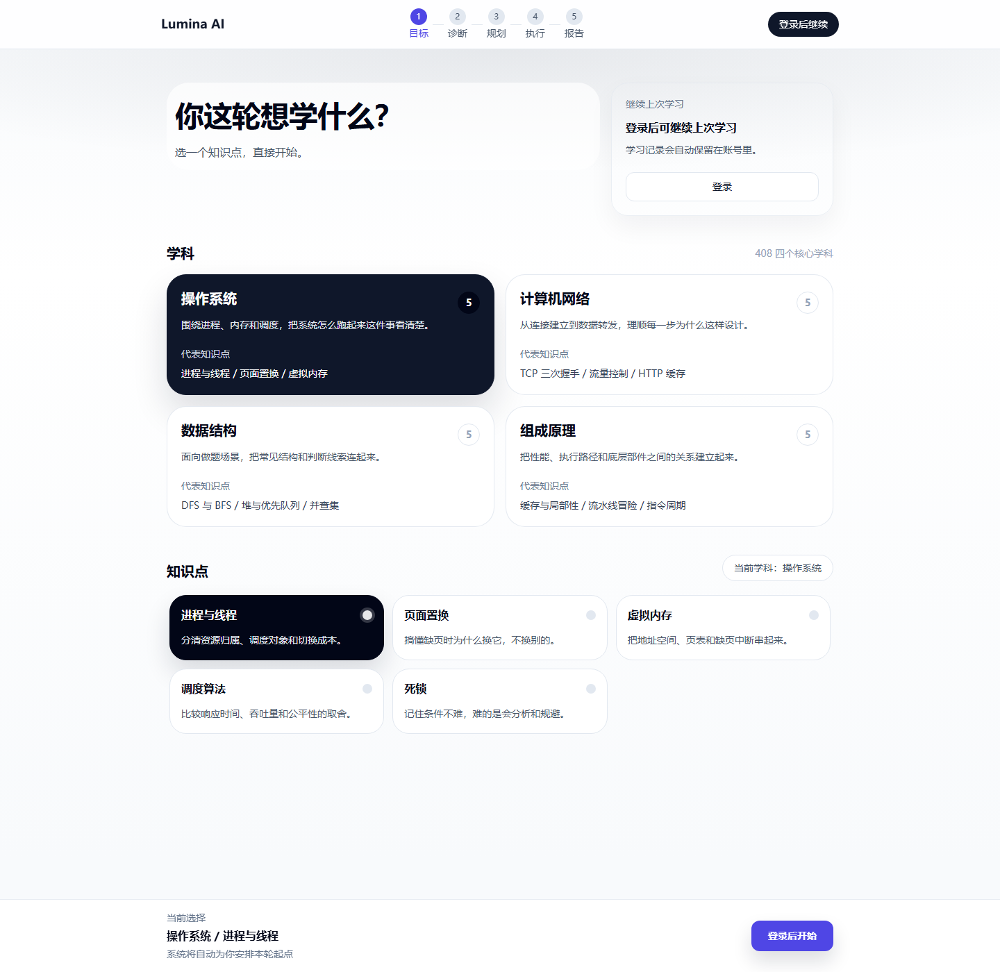
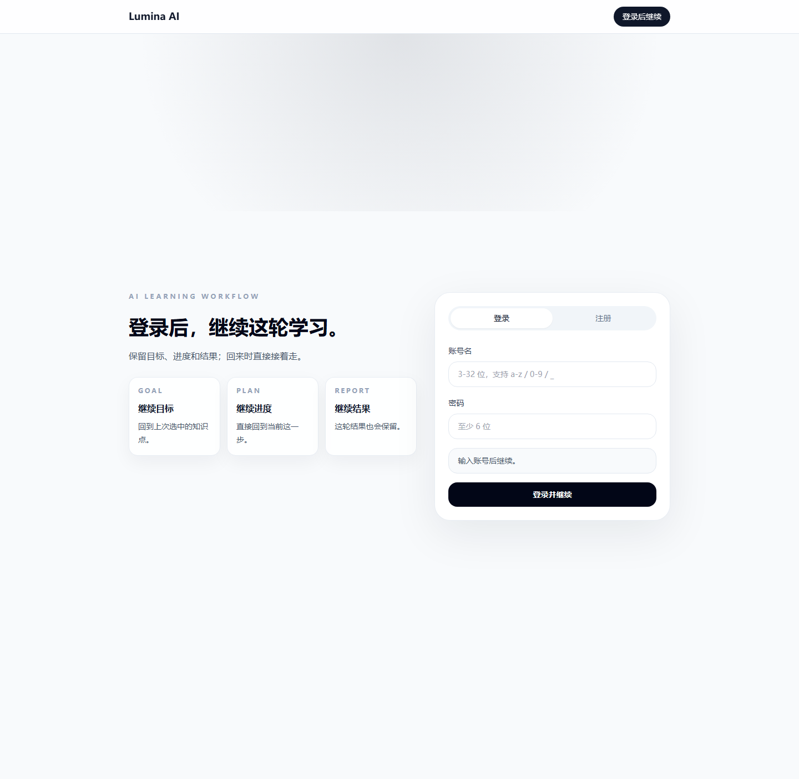
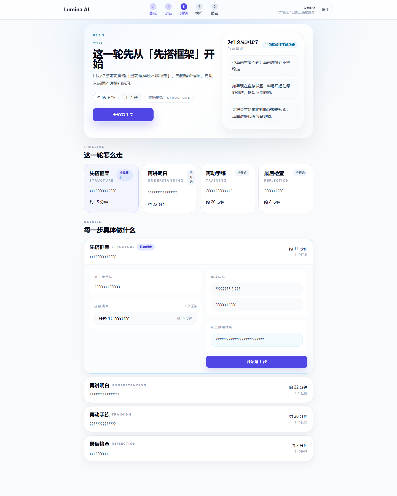
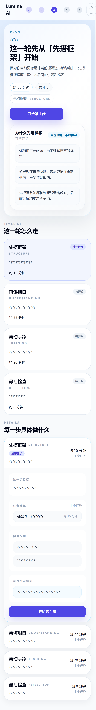
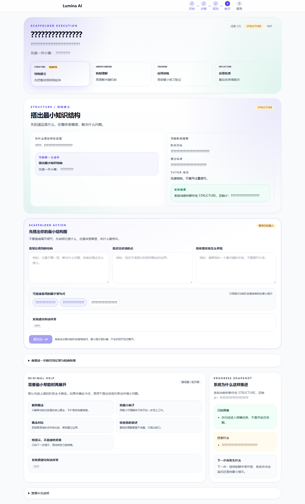
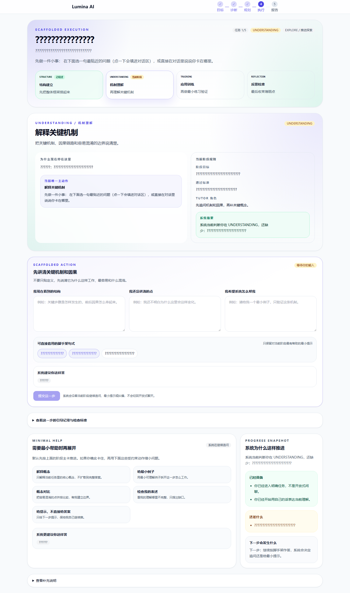
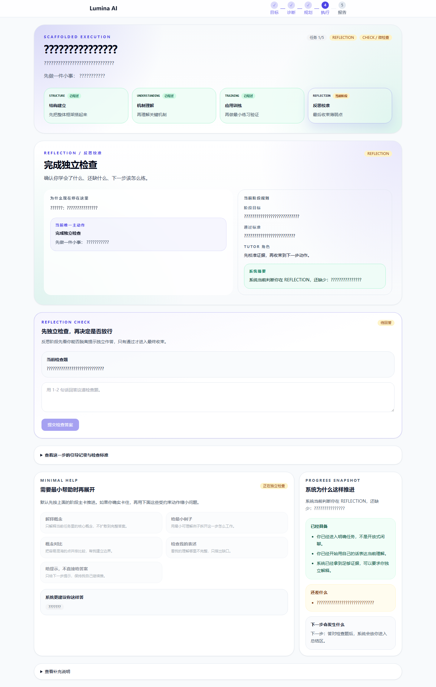
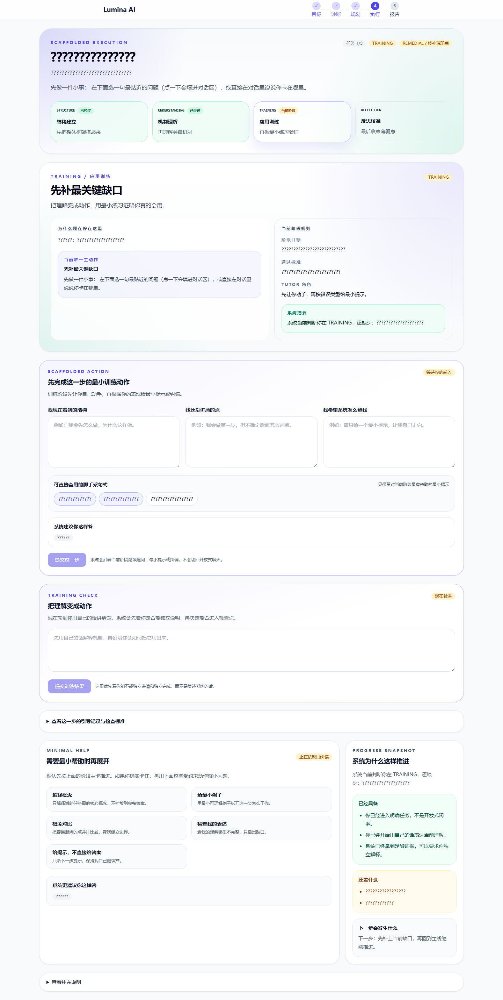
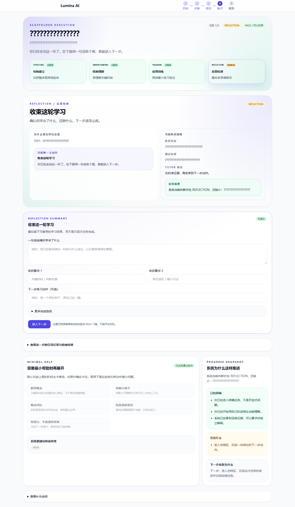

# 项目现状文档

更新时间：2026-03-31

本文基于以下事实整理，不是拍脑袋总结：

- 我实际检查了前端路由、核心页面、关键 store、API 封装、后端 controller / service / persistence / LLM / scaffold 代码。
- 我实际执行了后端全量测试：`backend` 目录下 `mvn test`，结果为 `93 tests, 0 failures, 0 errors`。
- 我实际执行了前端生产构建：`frontend` 目录下 `npm run build`，构建成功。
- 页面截图优先使用仓库内已存在的 `frontend/artifacts` 制品图。

说明：

- 下文里“已完成”指代码与构建层面已经存在，且主链路可跑。
- 下文里“稳定”主要指本地开发态 / 测试态稳定，不等于已验证生产环境稳定性。
- 仓库中的截图资源不是全部页面都有，且不保证与当前最新样式 100% 同步，所以我会同时给出真实描述。

## 一句话结论

这个项目已经不是 PPT 状态，而是一个“主链路打通、执行页做得最深、后端测试覆盖不错、但运行态架构还没彻底产品化”的版本。

如果只看当前完成度，我会判断：

- 前端主流程页面已成型。
- 目标 -> 诊断 -> 规划 -> 执行 -> 报告 这条主链路已打通。
- 执行页已经从“聊天壳”进化成“有任务驱动、有脚手架、有反馈闭环”的核心展示页。
- 后端接口从功能角度已经比较全，但底层仍是“内存态 + 数据库持久化”并存，离真正稳定上线还有一段距离。
- LLM 已接入，但系统设计明显是“LLM 可用更好，不可用也要能跑”。

## 1. 当前已经完成的页面

当前前端路由中可以看到这些页面：

- `/goal` 目标输入页
- `/auth/login`、`/auth/register` 登录注册页
- `/diagnosis` 诊断页
- `/plan` 学习规划页
- `/task` / `/tasks/:taskId/run` 任务执行页（当前真正核心）
- `/report` 报告页
- `/execution` 仍存在，但现在本质上是跳转壳，不再是核心执行页

### 1.1 目标输入页

状态判断：已完成，且是可用页面，不是占位页。

已实现内容：

- 学科选择
- 主题选择
- 登录态下继续最近一次学习
- 提交目标后直接进入诊断
- 页面底部有固定主 CTA，符合“单页一个主动作”

截图：

我的判断：

- 目标页已经具备产品首页的引导感，不像普通输入框页。
- 目前更像“预设主题驱动”的入口，而不是完全开放式目标编辑器。

### 1.2 登录 / 注册页

状态判断：已完成。

截图：

已实现内容：

- 登录、注册路由
- 未登录用户被主流程页面拦截后会跳登录
- 登录后支持回跳主流程

### 1.3 诊断页

状态判断：已完成。

已实现内容：

- 先创建 diagnosis session，再提交诊断答案
- 诊断问题围绕基础、卡点、节奏展开
- 不同 topic 可映射不同 diagnosis 配置
- 提交后进入 plan

真实评价：

- 这个页面不是复杂诊断引擎的完整可视化，而是偏“轻量快速诊断”。
- 但对主链路来说已经足够，能把后续规划需要的 profile 产出来。

### 1.4 规划页

状态判断：已完成，而且表达比较成熟。

已实现内容：

- 预览学习计划
- 展示“为什么这样规划”
- 展示阶段路径与第一任务
- commit plan 后创建 session，并进入执行

截图：

我的判断：

- 规划页已经不是简单列表，而是在强调“系统做了决策”。
- 这一页比较符合产品定位：不是把任务堆出来，而是告诉用户为什么从这里开始。

### 1.5 执行页

状态判断：这是当前最成熟、最像产品核心的一页。

说明：

- 旧的 `/execution` 页面现在只是一个跳转页。
- 真正承担执行体验的是 `TaskRunView.vue`。

仓库内已有的执行页阶段截图：

我的判断：

- 这页已经明显不是聊天窗口。
- 页面中心是 task/workbench/scaffold/action/feedback，而不是 message list。
- 这是当前最能体现“AI 学习工作流系统”而非“通用聊天产品”的页面。

### 1.6 报告页

状态判断：已完成。

已实现内容：

- 展示结果状态
- 展示已完成进展、未解决问题、证据摘要
- 展示学习方法画像
- 给出 next action decision
- 支持用户确认下一步动作

真实评价：

- 从代码看，报告页已经不是简单“恭喜完成”，而是会聚合执行证据和学习方法信号。
- 这符合产品闭环，但视觉表达上目前不如执行页有辨识度。

## 2. 已打通的链路

### 2.1 用户主链路

已打通：

`目标输入 -> 创建诊断 session -> 提交诊断 -> 预览计划 -> 提交计划 -> 创建 session -> 获取当前任务 -> 执行任务 -> 完成任务 -> 生成报告 -> 确认下一步`

这条链路不是推测，是有多重证据的：

- 前端路由和页面跳转完整存在。
- 前端 store 在保存 `goalId / diagnosisId / planId / sessionId / currentTaskId`。
- 后端 controller 全部齐全。
- 回归测试已经覆盖这条主链路。

### 2.2 登录态链路

已打通：

- 未登录访问诊断 / 规划 / 执行 / 报告会被拦到登录页。
- 登录后支持继续之前的学习 session。
- 首页支持“继续最近一次学习”。

### 2.3 执行内链路

已打通：

- 获取 scaffold
- 发消息推进任务
- 自我解释
- checkpoint 检查
- complete task
- 自动切换到下一任务或进入报告

### 2.4 Tutor / 辅助链路

已打通：

- AI tutor 单轮对话
- AI tutor 流式输出
- AI tutor feedback
- prefetch explain
- 任务执行页中的 floating tutor / panel 上下文绑定

### 2.5 Learning Scaffold 链路

已打通，但不是“所有主题通吃”：

- 当前是按 knowledge pack 开启
- 支持获取当前 stage
- 支持提交当前 action
- 支持生成结构骨架
- 支持完成 structure stage

结论：

- 主链路是通的。
- Tutor 和 scaffold 也已经接到主链路里，不是孤立 demo。
- 但 scaffold 明显还是“特定知识包先做深”的策略，不是通用引擎大规模铺开。

## 3. 执行页目前做到哪一步（重点）

这是当前项目最值得讲的部分。

### 3.1 当前不是“聊天执行页”，而是“任务驾驶舱”

从 `TaskRunView.vue` 的结构看，执行页已经有这些核心区块：

- 阶段头部
- 主任务 workbench
- 当前动作输入区
- task feedback deck
- 反思总结
- 双动作底栏
- tutor 上下文联动

说明它已经在做的是：

- 用户当前在哪一阶段
- 这一步为什么做
- 现在要交什么内容
- 提交后系统如何判断
- 如果卡住，怎么往下走

这很符合仓库 `AGENTS.md` 里强调的“where / what now / why / what next”。

### 3.2 执行状态机已经存在

从代码和测试看，执行态至少覆盖这些状态流转：

- `ORIENT`
- `EXPLORE`
- `SELF_EXPLAIN`
- `CHECK`
- `REMEDIAL`
- `PASS`

也就是说，系统已经不只是“用户发一句，AI 回一句”，而是在做受控推进。

### 3.3 Scaffold 执行引擎已经做到四阶段

当前 learning scaffold engine 已经能跑这条四阶段链路：

- `STRUCTURE`
- `UNDERSTANDING`
- `TRAINING`
- `REFLECTION`

而且不是纯前端写死：

- 后端有 stage 定义
- 有 validator / evaluator / tutor composer
- 有 action runtime
- 有 attempt snapshot
- 有 reflection record / insight
- 阶段完成后还能推动任务状态从 `ORIENT` 往 `EXPLORE` 走

这是一个非常关键的信号：

- 执行页的“脚手架感”已经有后端引擎支撑
- 不是仅靠文案假装引导

### 3.4 执行页现在的真实完成度判断

我给出的判断是：

- 已经完成“核心演示版”
- 已经足够支撑比赛展示或产品 demo
- 已经能体现产品方法论
- 但还没有达到“多知识主题可规模复用、长期可维护”的成熟阶段

为什么这么说：

- 任务执行页逻辑非常重，单页承担太多编排责任。
- scaffold 目前明显围绕特定主题 pack 深做。
- 页面虽然强于普通聊天壳，但工程层面耦合度还偏高。

## 4. 后端完成情况

### 4.1 已完成内容

后端当前已经具备：

- 目标创建接口
- 诊断 session 创建与诊断提交接口
- 计划 preview / commit 接口
- session 当前任务 / 当前指导 / 报告 / 下一步确认接口
- task scaffold / message / self-explanation / checkpoint / complete 接口
- ai-tutor prompt / explain / feedback / chat / stream 接口
- learning scaffold stage / action / structure skeleton / structure complete 接口
- auth 注册、登录、会话接口

从表结构和仓储层看，还已经接了：

- PostgreSQL
- Flyway migration
- MyBatis-Plus
- 任务执行 runtime 持久化
- task message / state transition / completion / method profile 存储
- 用户与 session 相关表

### 4.2 稳定性判断

我对“接口是否稳定”的真实判断是：

- 在本地开发和测试维度，已经相对稳定。
- 在真实线上运行维度，还不能直接说“稳定”。

依据：

- `mvn test` 全量通过：`93 tests, 0 failures, 0 errors`
- 测试覆盖了：
  - auth
  - sprint1 主链路
  - sprint2 report & next action
  - sprint3 task execution flow
  - phase6 主链路回归
  - LLM fallback
  - scaffold evaluator / validator / reflection / planning rule

所以我会写得更真实一点：

- “接口行为定义已经比较稳定”
- “本地回归稳定”
- “生产级稳定性尚未证明”

### 4.3 后端当前最大的架构现实

这是我认为非常重要的一点：

- 后端不是纯数据库驱动，而是明显存在 `InMemoryStore + DB 持久化` 双轨并存。

表现为：

- goal / diagnosis / plan / session / executableTaskSpec / runtime 等核心数据仍大量依赖 `InMemoryStore`
- 同时又有 repository 在做部分持久化
- `TaskExecutionPersistenceService` 能把 runtime / message / transition 落库
- 但主业务读取仍大量从内存状态拿

这意味着：

- 单机演示和测试很好用
- 但如果进程重启、横向扩容、多实例部署，当前架构会比较危险
- 数据一致性边界还没有完全收敛

所以如果要一句话评价后端现状，我会说：

“功能上够用了，架构上还没收口。”

## 5. LLM 接入情况

### 5.1 已有 tutor

是，已经有，而且不是只做了一个接口名。

当前已实现：

- `AI Tutor chat`
- `AI Tutor stream chat`
- `AI Tutor feedback`
- `prompt / explain / prefetch`
- 前端 `aiTutor` store
- 任务执行页 tutor 上下文绑定

从实现方式看：

- 有 `AiTutorServiceImpl`
- 有 `TutorPromptTemplates`
- 有 `TutorFallbackRegistry`
- 有缓存和 explain prefetch

### 5.2 已有 scaffold

是，已经有，而且比 tutor 更“产品化”。

当前 scaffold 不是单纯 prompt 模板，而是：

- stage-aware
- action-aware
- 有 validator / evaluator
- 有结构骨架生成
- 有 runtime 与 attempt snapshot
- 有 reflection 产物

### 5.3 LLM 接入的真实状态

当前 LLM 设计思路非常明确：

- LLM 可用时，优先走在线能力
- LLM 不可用时，系统必须 fallback，保证主链路不死

证据：

- `navigator.llm.enabled` 可配置
- 默认配置里 `enabled=false`
- 存在 `OpenAiCompatibleLlmGateway`
- 存在 `MockLlmGateway`
- 存在 tutor fallback
- 测试里专门验证了 provider 不可用时 fallback 成功

所以真实说法应该是：

- “已接入 LLM”
- “但系统不是强依赖实时 LLM”
- “当前更像可降级架构，而不是纯在线智能架构”

## 6. 当前最大问题（主观判断）

如果只能说一个，我认为不是 UI 细节，不是接口缺字段，而是：

## 核心运行态架构仍然是“演示可用，但产品化未收口”

具体表现为三点：

### 6.1 内存态与持久化双轨并存

这是最大问题。

影响：

- 很多核心业务状态仍依赖 `InMemoryStore`
- 系统恢复能力、部署方式、状态一致性都会受影响
- 后端看起来“有数据库”，但主业务并没有完全切到数据库模型上

这会直接限制：

- 线上稳定性
- 多实例部署
- 长 session 恢复
- 真正的用户数据连续性

### 6.2 执行页很强，但耦合也很重

`TaskRunView.vue` 已经承担了太多编排职责：

- 普通 task flow
- scaffold flow
- guidance flow
- tutor context
- closure flow
- local draft persistence

这说明它很强，但也说明：

- 后续继续迭代会越来越难
- 新知识包、新执行范式接入成本会升高

### 6.3 Scaffold 目前还是“特定主题深做”，不是平台能力

从实现上看，当前 scaffold engine 很强，但高度围绕已支持的知识包。

这意味着：

- 作为 demo 很有说服力
- 作为平台能力，还缺一层可扩展抽象

## 7. 我的最终判断

如果把当前项目分级，我会这样判断：

- 产品概念：已经清楚
- 主链路完成度：高
- 执行页完成度：最高，是当前项目核心亮点
- 后端功能完成度：高
- 后端架构成熟度：中等
- LLM 接入成熟度：中高，降级策略比“盲目接大模型”更成熟
- 可直接上线程度：一般，不建议直接按生产产品理解
- 可用于 demo / 比赛展示程度：高

最适合对外的真实表述是：

“这是一个已经打通完整学习工作流、并在任务执行页做出明显产品差异化的 AI 学习系统原型；当前最强的是执行引导与脚手架闭环，当前最大短板是运行态架构仍未完全从内存驱动过渡到稳定的持久化架构。”
