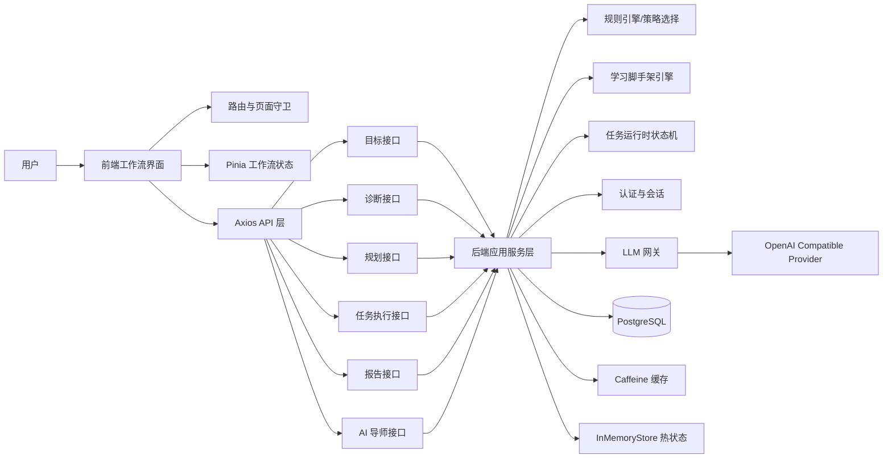
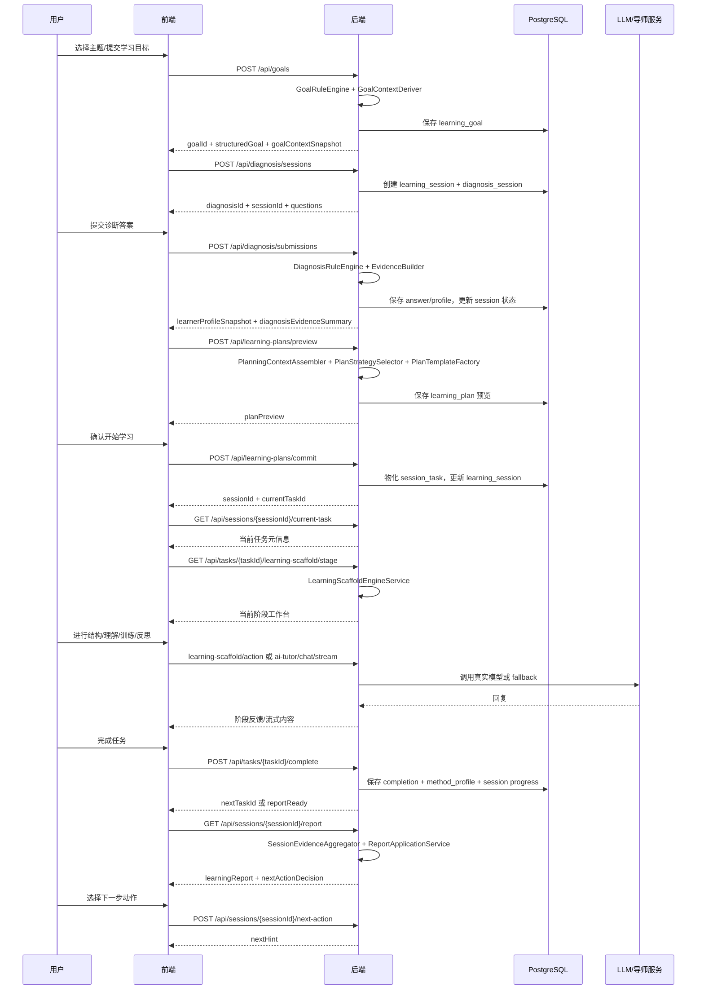

# AI Learning Workflow Navigator 项目报告

> 统计口径说明：本文基于 2026-04-03 仓库代码现状整理，面向项目答辩使用。  
> 报告重点不是把技术名词罗列一遍，而是说明这套系统如何围绕“目标 -> 诊断 -> 规划 -> 执行 -> 报告”的学习闭环落地。

---

## 项目概览

### 1. 项目定位

本项目不是通用聊天机器人，也不是传统课程平台，而是一套 **AI 引导式学习工作流系统**。  
它试图解决的问题不是“用户能不能问到答案”，而是“用户能不能在 AI 的帮助下完成一轮结构化学习”。

系统的核心产品逻辑是：

1. 用户先明确学习目标，而不是直接进入开放式聊天。
2. 系统通过结构化诊断，判断用户当前的基础、卡点、节奏和风险。
3. 系统根据目标与诊断结果生成个性化学习计划，而不是统一给内容。
4. 系统把计划拆成可执行任务，并用脚手架驱动用户完成表达、理解、训练和反思。
5. 系统在任务完成后生成学习报告，并给出下一步建议，形成可持续迭代的学习闭环。

### 2. 当前工程总体形态

- 前端：`Vue 3 + TypeScript + Vite + Pinia + Vue Router + Axios + TailwindCSS`
- 后端：`Spring Boot 3.2.5 + Java 17 + Spring MVC/WebFlux + MyBatis-Plus + PostgreSQL + Flyway`
- AI 能力：OpenAI Compatible LLM 接口 + 模板兜底 + 本地缓存 + SSE 流式输出
- 状态组织方式：前端使用页面路由与会话状态驱动；后端使用“学习会话 / 任务运行时 / 脚手架状态”驱动
- 当前重点展示知识包：`DFS / BFS` 四阶段学习脚手架

### 3. 当前工程规模

- 前端视图页：8 个
- 前端组件：122 个
- 前端 API 模块：11 个
- 前端 composables：5 个
- 后端控制器：9 个
- 后端服务/引擎/工厂/选择器类：24 个
- 持久化 Repository：32 个
- 数据库迁移脚本：7 个
- 后端测试：35 个

### 4. 总体架构图



---

## 一、前端技术

## 1. 前端技术栈与版本

前端工程位于 `frontend/`，使用的是比较标准但足够现代的 Vue 技术栈：

- `vue@3.5.30`
- `typescript@5.9.3`
- `vite@8.0.0`
- `pinia@3.0.4`
- `vue-router@5.0.3`
- `axios@1.13.6`
- `tailwindcss@3.4.19`

这一组合的核心优势在于：

- Vue 3 适合快速搭建组件化、可维护的工作流界面。
- TypeScript 为接口字段、状态模型、阶段模型提供了较强的静态约束。
- Vite 启动快、迭代快，适合高频前端调试。
- Pinia 足够轻量，适合本项目这种“流程状态”明显重于“复杂业务计算”的场景。
- Vue Router 很适合表达“页面即阶段”的产品结构。
- TailwindCSS 提升了 UI 实现效率，同时配合设计令牌避免样式散乱。

## 2. 前端的产品化设计思路

这个前端不是“把后端接口套一个页面”，而是按产品心智设计的：

- 每个页面对应一个明确的学习阶段。
- 每个页面尽量只有一个主动作，减少用户分心。
- 当前任务是第一屏核心内容，避免解释文字压过行动引导。
- UI 不是聊天窗口式自由输入，而是更接近“学习驾驶舱”。

这与仓库约定完全一致：项目强调的是 **学习脚手架**，而不是聊天体验本身。

## 3. 前端目录结构与分层

前端结构可以概括为 6 层：

1. `views/`：页面级视图，负责当前流程阶段的装配。
2. `components/`：可复用 UI 组件与业务组件。
3. `stores/`：工作流状态与认证状态。
4. `api/`：接口调用与统一错误处理。
5. `composables/`：跨页面/跨组件的可复用逻辑。
6. `types/`、`constants/`、`utils/`：类型系统、常量配置、映射与构造逻辑。

代表性文件：

- `frontend/src/router/index.ts`
- `frontend/src/stores/workflow.ts`
- `frontend/src/stores/auth.ts`
- `frontend/src/api/request.ts`
- `frontend/src/composables/useTaskRunSession.ts`
- `frontend/src/composables/useLearningScaffoldEngine.ts`

## 4. 路由系统：把业务阶段变成页面阶段

前端路由不是普通导航，而是业务状态机的可视化外壳。

当前主要路由如下：

- `/goal`：目标输入页
- `/auth/login`、`/auth/register`：认证页
- `/diagnosis`：诊断页
- `/plan`：规划页
- `/execution`：执行页入口
- `/tasks/:taskId/run`：任务运行页
- `/report`：报告页

路由守卫做了 4 件关键事情：

1. 在跳转前调用 `auth.ensureReady()`，保证用户认证状态可用。
2. 对需要登录的页面进行拦截，未登录则跳转到登录页。
3. 对学习流程顺序进行校验，例如没有 `goalId` 不能进诊断页，没有 `sessionId` 不能进任务页。
4. 如果已经存在 `sessionId`，则通过 `/api/sessions/{sessionId}/flow-state` 判断当前应该落在哪个页面和任务上，实现断点恢复。

这意味着前端不是“静态页面跳转”，而是 **根据会话状态决定正确落点**。

## 5. 全局状态管理：以“工作流上下文”为核心

`frontend/src/stores/workflow.ts` 是前端最关键的业务状态仓库，它维护了完整学习链路中的关键 ID 和结果快照：

- `goalId`
- `diagnosisId`
- `planId`
- `sessionId`
- `currentTaskId`
- `structuredGoal`
- `learnerProfileSnapshot`
- `diagnosisEvidenceSummary`
- `planPreview`
- `currentTask`
- `progress`
- `report`
- `nextActionDecision`

其设计特点：

- 使用 `sessionStorage` 持久化关键 ID，支持页面刷新后恢复流程。
- 将“新目标开始”和“当前执行状态清空”分开处理，便于继续学习与重新开始两类场景。
- 状态对象直接对齐后端 DTO，减少前后端字段转换成本。

这套 store 本质上承担的是 **前端工作流总线** 的角色。

## 6. 认证与续学能力

`frontend/src/stores/auth.ts` 管理认证用户与最近学习记录：

- 登录/注册后会刷新 `/api/auth/me`
- `recentLearningEntry` 用于首页“继续学习”
- `pendingRedirect` 用于登录后回到原始目标页或业务页

首页 `GoalInputView.vue` 不是只有“开始新学习”，还支持：

- 未登录时引导登录
- 已登录但没有学习记录时显示空状态
- 已登录且有最近会话时通过 `getSessionFlowState` 自动恢复到诊断、规划、执行或报告页

这体现出前端不仅关注一次性演示，也考虑了 **真实连续使用场景**。

## 7. API 层：统一请求实例 + 统一错误协议

`frontend/src/api/request.ts` 做了很关键的一层封装：

- 使用统一的 Axios 实例
- 默认 `withCredentials: true`，配合后端 Cookie 会话
- 默认超时 30 秒
- 拦截统一响应结构 `GlobalResponse<T>`
- 只有 `code === OK` 才把 `data` 解包给业务层
- 将业务错误码统一转成前端可消费的 `{ code, message }`

这意味着前端页面不需要关心底层 HTTP 的细节，而只处理“业务成功或失败”。

## 8. 页面设计：按业务闭环组织，而不是按通用模板组织

### 8.1 目标页

`GoalInputView.vue` 的职责不只是输入文本，而是承担“闭环起点”和“主题入口”：

- 将主题选择做成可视化卡片
- 根据选中的主题构建标准化 `CreateGoalRequest`
- 目标创建成功后写入 `goalId`、`structuredGoal`、`goalContextSnapshot`
- 自动切到诊断页

这一步将“用户想学什么”转成后续可以计算、规划和追踪的结构化目标。

### 8.2 诊断页

`DiagnosisView.vue` 通过三个问题快速收集：

- 基础状态
- 当前卡点
- 推进节奏

页面特点：

- 首次进入会自动创建 diagnosis session
- 支持知识包主题对诊断题进行适配
- 提交后写入 `learnerProfileSnapshot` 和 `diagnosisEvidenceSummary`
- 直接进入规划页

这一步把“模糊用户状态”变成了 **可计算的学习画像**。

### 8.3 规划页

`LearningPlanDecisionView.vue` 把规划结果做成“决策展示页”：

- 不是简单列任务，而是先呈现推荐理由
- 通过 Hero、Why、StageRail、FirstTaskCard 说明为什么这样安排
- 点击开始后调用 `commitPlan`
- 将 `sessionId` 和 `currentTaskId` 写入 store

这一页非常适合答辩时强调项目不是随机生成内容，而是 **给出可解释的计划决策**。

### 8.4 任务运行页

`TaskRunView.vue` 是当前产品最核心的展示页，也是最能体现“学习工作流系统”而非“聊天壳”的页面。

它做了几件非常关键的事情：

1. 用 `useTaskRunSession` 负责拉取当前任务并对齐路由。
2. 用 `useLearningScaffoldEngine` 管理脚手架阶段、动作卡、快速加载与完整加载。
3. 将任务执行拆成四个清晰阶段：
   - `structure`
   - `understanding`
   - `training`
   - `reflection`
4. 对理解与训练阶段使用 AI 导师流式对话。
5. 对阶段状态做本地快照持久化，避免用户刷新时丢失会话内容。
6. 最终将整个任务收束为可提交的 `completeTask` 请求。

这说明前端的核心不是“消息列表”，而是 **阶段化学习工作台**。

### 8.5 报告页

`ReportView.vue` 会做两层处理：

- 如果后端判定当前会话还没完成，就提示回到当前任务
- 如果报告可用，就展示结果状态、收获、缺口、学习方式分析和下一步动作

这一步确保系统不只负责“把用户带到任务”，还负责 **完成一轮学习后的结果回收与后续建议**。

## 9. 脚手架引擎在前端的实现方式

`useLearningScaffoldEngine.ts` 是任务执行页的重要技术亮点。

它采用的是“快照式双阶段加载”策略：

- `fast` 模式：优先返回当前阶段动作卡与基础工作台，确保页面反馈快
- `full` 模式：再补全完整工作台软文案和辅助内容，提升体验完整度

它还做了这些优化：

- 对相同任务/会话/阶段的请求做去重
- 维护 `currentActionId`
- 支持动作提交后直接合并更新阶段
- 自动判断哪些阶段已完成
- 在前端将后端 `stageKey` 映射为中文阶段名

这套实现说明前端不是被动渲染接口，而是在做 **高频交互状态协调**。

## 10. AI 流式能力在前端的实现

`frontend/src/api/tutor.ts` 使用原生 `fetch` + `ReadableStream` 处理 SSE：

- 请求 `/api/ai-tutor/chat/stream`
- 识别 `meta`、`delta`、`done`、`error` 四类事件
- 将 `<reply>...</reply>` 中的增量内容逐段写入界面
- 在 `done` 事件中收取 `canProceed`、`finalDraft`、`completionHint`、`summary`

这让理解与训练阶段能够具备“边生成边显示”的导师交互体验。

## 11. 前端状态与会话恢复机制

为了支持真实的学习中断场景，前端做了多层恢复：

- 关键工作流 ID 使用 `sessionStorage`
- 理解/训练对话消息使用按 `taskId + phase` 维度的快照存储
- 首页可根据最近学习记录继续会话
- 路由守卫可基于 `flow-state` 自动修正落点

这比一般 Demo 前端更进一步，因为它已经在考虑 **流程连续性**。

## 12. 设计系统与视觉一致性

前端并没有随意拼页面，而是通过 `design/tokens.ts` 和 `style.css` 维护统一视觉令牌：

- 颜色令牌
- 阶段色
- 间距令牌
- 圆角令牌
- 阴影令牌
- 文字层级

对应策略包括：

- 统一背景、卡片、按钮、阴影风格
- 当前阶段使用明显但克制的识别色
- 主操作区优先级高于解释区
- 采用卡片化布局降低认知负担

这与仓库中的设计约束完全一致：**页面必须帮助用户知道现在在哪、为什么在这、接下来做什么**。

## 13. 前端当前的产品亮点

从答辩角度看，前端最值得强调的不是“用了 Vue”，而是：

1. 它把学习流程做成了可视化工作流，而不是自由聊天。
2. 它把任务执行做成了四阶段脚手架工作台，而不是单轮问答。
3. 它支持流式导师交互、阶段推进、会话恢复和结果回收。
4. 它的 UI 是围绕“当前任务”和“下一步动作”组织的，产品意图非常明确。

---

## 二、后端技术

## 1. 后端技术栈与运行形态

后端工程位于 `backend/`，是一个基于 Spring Boot 的单体服务。

核心技术栈如下：

- `Spring Boot 3.2.5`
- `Java 17`
- `spring-boot-starter-web`
- `spring-boot-starter-webflux`
- `spring-boot-starter-validation`
- `spring-security-crypto`
- `MyBatis-Plus 3.5.5`
- `PostgreSQL`
- `Flyway 10.21.0`
- `Caffeine`
- 测试：`spring-boot-starter-test + H2`

这里的关键点是：

- 主体接口仍然是典型 Spring MVC 风格。
- 引入 WebFlux 主要是为了方便输出 `Flux<ServerSentEvent<...>>`，支持流式导师回复。
- 这是一套“单体 + 清晰分层 + 局部异步”的设计，而不是微服务。

## 2. 后端分层架构

从代码组织看，后端大体分为：

1. `api`：控制器、鉴权、统一返回、异常处理
2. `application`：业务编排、规则引擎、脚手架引擎、任务执行服务
3. `domain`：领域模型、枚举、策略对象
4. `infrastructure`：数据库访问、缓存、LLM 客户端、JSON 序列化

这一结构的优点是：

- Controller 很薄，负责参数接收与响应包装。
- 核心业务逻辑集中在 Application 层，便于讲清业务。
- Domain 模型承载业务语义，而不是所有逻辑都塞在 DTO 里。
- 基础设施能力对业务层做了隔离。

## 3. API 层：用统一协议组织整个学习闭环

后端控制器共有 9 个，分别承担不同闭环节点：

- `GoalController`
- `DiagnosisController`
- `LearningPlanController`
- `SessionController`
- `TaskController`
- `LearningScaffoldController`
- `AiTutorController`
- `AuthController`
- `TaskFeedbackController`

接口协议特点：

- 统一返回 `GlobalResponse<T>`
- 统一业务异常映射为标准 HTTP 状态与业务码
- 控制器只做参数组装，几乎不写业务判断

例如：

- 目标创建走 `GoalApplicationService`
- 诊断会话与诊断提交走 `DiagnosisApplicationService`
- 规划预览与提交走 `PlanningApplicationService`
- 当前任务、流程状态、任务完成走 `ExecutionApplicationService`
- 报告生成与下一步确认走 `ReportApplicationService`

## 4. 认证机制：基于 Cookie 的轻量会话认证

项目的认证不是 OAuth 体系，而是更适合课程式产品演示的轻量方案：

- 注册和登录后由后端生成随机 token
- 对 token 做 SHA-256 哈希后存入 `user_session`
- 原始 token 写入 HttpOnly Cookie
- 后续请求通过 `AuthInterceptor` 解析当前用户

特点是：

- 认证成本低，便于演示
- 用户会话可长期保留，支持“继续学习”
- `/api/auth/me` 不只返回用户信息，还返回最近学习入口

这说明认证系统是为学习流程服务的，而不是独立存在。

## 5. 目标建模：从自然语言目标到结构化目标

`GoalApplicationService` 的职责是：

1. 接收 `LearningGoalInput`
2. 通过 `GoalRuleEngine` 做规则抽取
3. 生成 `StructuredLearningGoal`
4. 通过 `GoalContextDeriver` 生成 `GoalContextSnapshot`
5. 持久化到 `learning_goal`

`GoalRuleEngine` 会推导：

- `goalType`
- `subject`
- `topicScopeType`
- `topics`
- `urgencyLevel`
- `expectedDepth`
- `priorityModule`

`GoalContextDeriver` 会进一步推导：

- `planningMode`
- `entryGranularity`
- `riskTags`
- `strategyHints`
- `explanationFocus`

也就是说，后端并不是把用户原话直接传下去，而是把目标先加工成 **后续诊断、规划、执行都能复用的结构化上下文**。

## 6. 诊断模块：把主观输入转成可计算画像

`DiagnosisApplicationService` 分为两个动作：

1. `createSession(goalId)`：创建诊断会话并生成题目
2. `submit(diagnosisSubmission)`：提交答案并生成学习画像

这里用到了多个内部模块：

- `DiagnosisQuestionBank`：提供诊断题
- `DiagnosisAnswerNormalizer`：标准化答案
- `DiagnosisRuleEngine`：生成 `LearnerProfileSnapshot`
- `DiagnosisEvidenceBuilder`：生成诊断证据摘要
- `LearnerStrategyProfileDeriver`：生成学习策略画像

最终输出包括：

- 基础水平
- 当前主要断层
- 执行稳定性
- 学习偏好
- 风险标签
- 诊断证据摘要

这一步是后续个性化规划的依据，因此它是整个闭环里的“状态识别层”。

## 7. 规划模块：规则驱动的策略选择与任务模板生成

`PlanningApplicationService` 是规划阶段的核心。

它的核心逻辑不是“调用 LLM 生成计划”，而是：

1. 通过 `PlanningContextAssembler` 组装规划上下文
2. 通过 `PlanStrategySelector` 在规则引擎中选择策略
3. 通过 `RecommendedEntryBuilder` 生成推荐入口
4. 通过 `PlanTemplateFactory` 生成阶段和任务蓝图
5. 将预览结果持久化到数据库
6. 提交后 materialize 为会话任务与可执行任务规格

当前支持的主要策略有：

- `FOUNDATION_PATCH`
- `FRAMEWORK_BUILD`
- `DRILL_STRENGTHEN`
- `SPRINT_CORRECTION`
- `LOCAL_REPAIR`
- `CONCEPT_CLARIFICATION`

这说明规划层的核心思想是 **规则驱动的个性化任务编排**，而不是随机输出一段学习建议。

## 8. 任务执行模块：真正把“学习”做成状态机

后端最值得答辩展开的部分之一是任务执行模块。

`TaskExecutionFlowService` 负责：

- 确保任务运行时存在
- 维护 `TaskExecutionRuntime`
- 根据用户行为判断学习动作类型
- 推动任务状态迁移
- 记录消息、转移、证据和检查结果

其内部存在一个明确的任务执行状态机，例如：

- `INIT`
- `ORIENT`
- `EXPLORE`
- `SELF_EXPLAIN`
- `CHECK`
- `REMEDIAL`
- `PASS`

这意味着系统不是只记录“用户发了一句话”，而是记录 **用户当前处于任务推进的哪个阶段**。

## 9. 学习引导规则：不是随便回复，而是按学习阶段干预

除了任务状态机，系统还有一层学习引导阶段：

- `CLARIFY_GOAL`
- `BUILD_FRAME`
- `TRY_EXPRESS`
- `PROBE_GAPS`
- `META_REFLECT`
- `TRANSITION_HINT`

`GuidanceRuleEngine` 会根据学习证据选择当前指导阶段。  
`TaskGuidanceEngine` 再结合用户行为类型，决定当前应该：

- 问澄清问题
- 给提示
- 纠正误解
- 引导自我表达
- 引导进入收束

这让系统具备了“会教学”的结构，而不是简单“会回答”。

## 10. 学习脚手架引擎：项目最核心的后端创新点

`LearningScaffoldEngineService` 是本项目最有辨识度的模块之一。

它的职责是：

- 基于任务与知识包加载当前阶段脚手架
- 维护脚手架引擎状态 `LearningScaffoldEngineState`
- 提供阶段工作台 DTO `StageScaffold`
- 接收用户在脚手架动作卡上的输入
- 做结构校验、训练评估、反思汇总
- 在阶段完成后切换到下一阶段

当前脚手架引擎已经明确实现了 `DFS / BFS` 知识包的四阶段学习链路：

1. `STRUCTURE`
2. `UNDERSTANDING`
3. `TRAINING`
4. `REFLECTION`

技术上它还做了两件重要事情：

- 将旧状态兼容迁移到新阶段模型
- 在 REFLECTION 完成后把任务执行状态推进到 `PASS`，允许任务真正完成

从产品上看，这个模块把“脚手架”从 UI 文案上升成了 **后端可校验、可推进、可持久化的学习引擎**。

## 11. 知识包机制：面向扩展的内容组织方式

`KnowledgePackMetadata` 会根据目标内容识别知识包元信息，例如：

- 进程/线程对比
- TCP 三次握手
- DFS / BFS
- 缓存局部性

而 `LearningScaffoldPackRegistry` 目前真正开启四阶段脚手架引擎的知识包是：

- `ds_dfs_bfs`

这说明系统当前已经具备 **多知识包识别能力**，但深度脚手架引擎仍处于重点示范型扩展阶段。  
这在答辩中可以表述为：平台能力已抽象出来，当前以 DFS/BFS 作为核心 showcase 场景打透。

## 12. AI 导师模块：真实 LLM + 模板兜底 + 流式输出

`AiTutorController` 对外提供：

- prompt
- explain
- feedback
- prefetch
- chat
- chat/stream

`AiTutorServiceImpl` 内部做了多层策略：

### 12.1 普通文本 explain/prompt

- 先查 Caffeine 缓存
- explain 支持预取
- 没命中则走模板兜底或回退文案

### 12.2 chat 同步回复

- 需要真实 LLM Provider 就绪
- 后端要求 LLM 返回结构化标签，例如：
  - `<reply>`
  - `<can_proceed>`
  - `<completion_hint>`
  - `<summary>`
  - `<final_draft>`

### 12.3 chat 流式回复

- 通过 WebFlux `Flux<ServerSentEvent<...>>` 输出
- 前端边收边渲染 reply delta
- 最后通过 done 事件回传总结字段

### 12.4 feedback

- 走短超时 feedback 模式
- 优先解析 LLM JSON
- 如果 JSON 不可靠则走 fallback 反馈

这说明本系统没有把“AI 失败”视为系统失败，而是做了 **多层降级与韧性设计**。

## 13. LLM 接入与调用隔离

后端通过抽象接口 `LlmClient` 隔离了业务与供应商实现：

- `chat`
- `chatStream`
- `chatForFeedback`
- `chatForScaffold`
- `isLiveProviderReady`

`OpenAiCompatibleLlmGateway` 对接 OpenAI Compatible provider。  
`TaskTutorOrchestrator` 则在业务上进一步做受控编排：

- 根据任务目标和完成标准拼接 prompt
- 控制导师回复边界，避免直接泄题
- 当真实 LLM 不可用时退回 `MockLlmGateway`

所以本项目对 AI 的使用不是“前端直接调大模型”，而是经过后端策略层严格约束。

## 14. 缓存与异步能力

后端使用两类重要性能机制：

### 14.1 Caffeine 本地缓存

`TutorContentCache` 用于缓存：

- explain 内容
- prompt 内容

特点：

- TTL 10 分钟
- 最大 10000 条

### 14.2 异步线程池

`AsyncConfig` 配置了 `aiTutorExecutor`：

- CorePoolSize = 2
- MaxPoolSize = 8
- QueueCapacity = 200

主要用于 explain 预取与缓存回填，避免阻塞 HTTP 主线程。

## 15. 数据持久化：关系型数据库 + JSON 快照

数据库层采用 PostgreSQL，ORM/DAO 层采用 MyBatis-Plus。

持久化策略有两个鲜明特点：

### 15.1 核心主数据使用关系型表

例如：

- `learning_goal`
- `learning_session`
- `diagnosis_session`
- `diagnosis_answer`
- `learner_profile_snapshot`
- `learning_plan`
- `session_task`
- `task_interaction`
- `task_completion`

### 15.2 复杂结构使用 JSON 快照字段

例如：

- `structured_goal_json`
- `goal_context_json`
- `questions_json`
- `profile_json`
- `plan_snapshot_json`
- `task_snapshot_json`
- `completion_input_json`
- `scaffold_json`

这样设计的好处是：

- 结构复杂对象不用强行拆得过细
- 领域模型可以快速演化
- 关键业务表仍保留关系型索引与可追踪性

## 16. 任务运行时持久化：支持中断恢复的关键技术

`V5__task_execution_runtime_persistence.sql` 新增了运行时相关表：

- `task_execution_runtime`
- `task_state_transition`
- `task_message`
- `task_checkpoint_result`
- `task_method_profile`

这批表记录了：

- 当前任务脚手架快照
- 任务状态转移历史
- 消息轨迹
- 检查点结果
- 学习方法画像

这也是本项目能支撑“任务执行不是一次性页面动作”的关键原因。

## 17. InMemoryStore + DB 补水：性能与恢复的折中

后端并不是所有内容都每次从数据库现查，而是采用了一个很实用的混合模式：

- 热数据放在 `InMemoryStore`
- 必要时从数据库补水恢复

例如：

- `ExecutionSessionStateService.loadOrHydrateLearningSession`
- `TaskExecutionPersistenceService.loadRuntime`
- `SessionReadFacade`

这种做法的价值在于：

- 运行期操作快
- 断点恢复仍有保障
- 适合单体演示系统向更正式系统过渡

## 18. 报告生成：从执行证据回收为学习结果

`ReportApplicationService` 会在会话完成后：

1. 聚合执行证据
2. 汇总学习方式画像
3. 生成结果状态
4. 提炼“学会了什么”
5. 提炼“还需要补什么”
6. 生成下一步建议

这里的输出不只是总结文案，还包含：

- `resultStatus`
- `whatYouLearned`
- `whatStillNeedsWork`
- `evidenceDigest`
- `learningMethodReview`
- `recommendedNextStep`
- `taskHighlights`

这意味着报告页不是单纯展示接口结果，而是后端完成了一轮 **学习结果评价与行动决策**。

## 19. 测试体系

后端当前已有 35 个测试文件，覆盖范围包括：

- Sprint 级集成链路
- 任务执行持久化恢复
- LLM fallback
- AI tutor chat / stream API
- Auth Controller
- Diagnosis rule engine
- Planning rule
- Scaffold validators / evaluators
- CompletionEvaluator
- LearningEvidenceBuilder 等

从工程成熟度上看，这个项目已经不是纯 Demo 代码，而是有比较清晰的业务测试意识。

## 20. 后端当前的答辩亮点

后端最值得讲的不是“用了 Spring Boot”，而是：

1. 它把学习过程拆成了目标、诊断、规划、执行、报告五个清晰阶段。
2. 它用规则引擎保证了目标理解、诊断收敛和规划选择的可解释性。
3. 它用任务运行时状态机和脚手架引擎，把学习过程做成了真正可跟踪、可推进的系统。
4. 它对 AI 做了缓存、回退、Mock、流式输出和结构化解析，不把系统稳定性完全押在模型上。

---

## 三、业务流转

## 1. 核心业务闭环

本项目的核心闭环非常明确：

```text
目标输入 -> 诊断 -> 规划 -> 执行 -> 报告 -> 下一步动作
```

这条链路的核心价值在于：

- 先搞清用户要什么
- 再判断用户现在处于什么状态
- 再决定怎么学
- 再推动用户执行
- 最后把结果回收成下一步建议

因此本系统的“产品单位”不是一轮聊天，而是一轮 **可收尾、可复盘、可继续的学习会话**。

## 2. 端到端时序图



## 3. 各阶段的业务意义与输入输出

### 3.1 目标阶段

输入：

- 用户主题选择
- 时间预算
- 自我水平
- 学习偏好

系统输出：

- `goalId`
- `StructuredLearningGoal`
- `GoalContextSnapshot`

业务意义：

- 把模糊目标变成结构化目标
- 给后续诊断和规划提供统一输入

### 3.2 诊断阶段

输入：

- `goalId`
- 用户诊断题答案

系统输出：

- `diagnosisId`
- `LearnerProfileSnapshot`
- `LearnerStrategyProfile`
- `DiagnosisEvidenceSummary`

业务意义：

- 把“我感觉自己不会”转换成可用画像
- 给规划层提供个性化依据

### 3.3 规划阶段

输入：

- `goalId`
- `diagnosisId`

系统输出：

- `planId`
- 推荐入口
- 推荐策略
- 阶段与任务列表
- 成功标准
- 风险与关键证据

业务意义：

- 给出可解释的学习路线，而不是泛化建议
- 将复杂目标拆为当前可执行任务

### 3.4 执行阶段

输入：

- `sessionId`
- 当前任务 ID
- 用户表达、选择、训练和反思行为

系统输出：

- 当前任务元信息
- 阶段脚手架
- 流式导师反馈
- 执行证据
- 任务完成记录

业务意义：

- 将“计划”真正转成可执行学习行为
- 系统不仅回应，还主动推动下一步动作

### 3.5 报告阶段

输入：

- 当前 session 的所有执行轨迹

系统输出：

- 学习结果状态
- 学会了什么
- 仍需补什么
- 方法反馈
- 下一步建议

业务意义：

- 形成完整学习闭环
- 帮助用户看到阶段成果和后续方向

## 4. 业务中的关键 ID 体系

系统通过一组非常清晰的业务 ID 串联全链路：

- `goal_xxx`
- `diag_xxx`
- `plan_xxx`
- `learn_session_xxx`
- `plan_xxx_task_x`

这些 ID 的作用不是简单标识记录，而是承载每个业务阶段的上下文。

例如：

- `goalId` 是目标建模结果
- `diagnosisId` 是用户状态诊断结果
- `planId` 是本次个性化规划结果
- `sessionId` 是本轮学习会话主键
- `taskId` 是执行阶段的最小推进单元

这让系统天然适合做：

- 刷新恢复
- 继续学习
- 报告回查
- 多轮学习扩展

## 5. 业务中的“状态驱动”思想

本项目最大的业务设计特点之一，是它不是围绕“消息”组织，而是围绕“状态”组织：

- 会话状态：现在在诊断、规划、执行还是报告
- 任务状态：当前任务是否已完成、是否可以进入下一个任务
- 执行状态：当前在探索、自解释、检查还是补救
- 脚手架状态：当前处于结构、理解、训练还是反思

因此，系统真正管理的是 **学习过程的推进状态**，而不是一条条散乱的聊天消息。

## 6. 为什么这个项目不是聊天机器人

在答辩中，这一部分很重要，可以直接从业务流转上说明：

1. 用户不能一上来就自由聊天，必须先进入目标建模。
2. 系统先诊断用户状态，再规划学习路径，而不是直接生成答案。
3. 任务执行不是连续聊天，而是分阶段工作台推进。
4. 系统会记录行为证据、阶段结果、方法画像，并在最后生成报告。
5. 最终交付的是一轮学习闭环，而不是一次问答响应。

所以，这个产品更准确的定位是：

**AI 驱动的学习流程系统**，而不是 **带壳的 LLM Chat UI**。

## 7. 当前业务示范点与扩展性

当前代码里最完整、最可展示的场景是：

- 数据结构主题中的 `DFS / BFS`
- 四阶段脚手架执行
- AI 导师流式引导
- 执行证据回收到报告

同时，系统又已经具备扩展基础：

- 目标规则与诊断规则是可继续扩展的
- 规划策略可继续加规则
- 知识包识别可继续扩展
- 脚手架引擎可继续支持更多 pack
- 报告与下一步建议已经具备统一生成出口

这意味着项目不是一套一次性硬编码页面，而是已经形成了 **平台化雏形**。

## 8. 适合答辩的总结表达

如果要用一句话总结项目的业务价值，可以这样表述：

> 本项目不是让 AI 替用户学习，而是把“如何高质量使用 AI 学习”这件事做成了一套可感知、可推进、可复盘的产品闭环。

如果要用一句话总结技术价值，可以这样表述：

> 技术上，我们把前端工作流、后端规则引擎、任务状态机、学习脚手架引擎和 LLM 能力编排在一起，让系统能够真正管理学习过程，而不是只管理聊天内容。

---

## 结论

从整体上看，这个项目已经形成了比较完整的三层能力：

1. **前端层**：把学习流程做成清晰可操作的产品界面。
2. **后端层**：把目标、诊断、规划、执行、报告做成可持久化、可恢复、可解释的业务系统。
3. **AI 层**：把大模型能力放在受控框架中使用，用于导师反馈、脚手架提示和学习推进，而不是无边界生成。

因此，这个项目的真正竞争力不在于“接了一个大模型”，而在于：

- 它定义了学习闭环
- 它组织了学习状态
- 它实现了学习推进
- 它完成了学习回收

这也是它能够在答辩中区别于普通 AI Demo 的核心原因。
